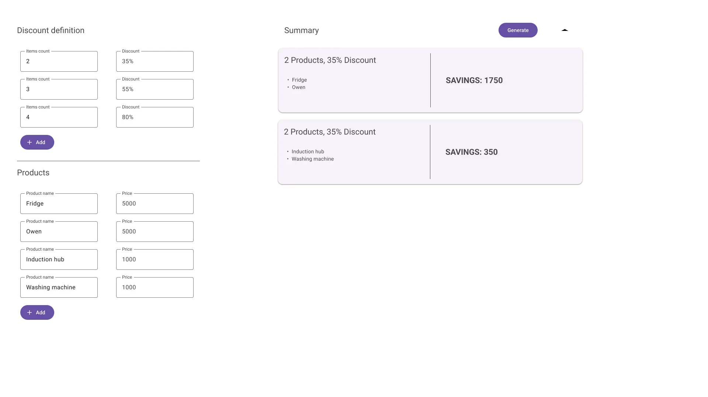

# Multidiscount calculator

> Part 1

## Setting up a new project

- To set up a project create a new directory with **_multidiscount-calculator_** name and move to this project:

    ```bash
    mkdir multidiscount-calculator
    cd multidiscount-calculator
    ```

- Initialize git repository:

    ```bash
    git init
    ```

- Create **_index.html_** and **_index.js_** files:

    ```bash
    touch index.html index.js
    ```

- After finishing this step, your project structure should look like that:

    ```bash
    multidiscount-calculator/
    ├── index.html
    └── index.js
    ```

## Requirements

- User should be able to define what discount will be applied if you buy n products. For example: 2 products → 20%
  discount, 3 products → 40% discount, 4 products → 80% discount ...
- User should be able to add products. Each product should contain two information: product name, product price
- At the beginning there is only one section with two inputs to add product name and product price. Below this section
  there should be a button that allows the user to add a new section where another product can be defined
- User should be able to add as many products as he wants
- Above the first section there should be a button with information to click and generate a summary with grouped
  products to get the biggest discount
- Create an algorithm that will create a summary of how to group products to get the biggest discount.

### Algorithm acceptance criteria

I know that shop offers multi-discount that is applied on the cheapest product. If I buy 2 products I
can receive a 30% discount, if I buy 3 products I can receive a 55% discount, if I buy 4 products I can receive an 80%
discount. I want to buy 4 products: **product1** priced at 1000$, **product2** priced at 1000$, **product3** priced at
100$, **product4** priced at 100$. Let's consider the below scenarios:

1. I will buy 4 products on one invoice. Then I will save 80$ as a discount is applied on the cheapest product.
2. I will buy **product1 (1000$)** and **product3 (100$)** on one invoice and **product2 (1000$)** and
   **product4 (100$)** on another invoice. Then I will save 30$ on the first invoice and 30$ on the second invoice. In
   total, I save 60$
3. I will buy **product1 (1000$)**, **product2 (1000$)** and **product3 (100$)** on one invoice and **product4 (100$)**
   on another invoice. Then I will save 55$ on the first invoice and 0$ on the second invoice. In total, I saved 55$
4. I will buy **product1 (1000$)** and **product2 (1000$)** on one invoice and **product3 (100$)** and
   **product4 (100$)** on another invoice. Then I will save 300$ on the first invoice and 30$ on the second invoice. In
   total, I save 330$

From the above scenarios, we can see that even if the discount is highest if I buy 4 products on one invoice, it doesn't
mean I will save the most significant amount of money, I will save 80$. Much better will be to buy 2 more expensive
products on one invoice and 2 cheaper products on another invoice than I will save 330$ (250$ difference). This
algorithm should recommend this scenario ***4*** as the most optimal.

## Design proposition



## Hints

- To get more familiar with ***`<form>`*** that you can use to collect user input, you can check this
  link [https://developer.mozilla.org/en-US/docs/Web/HTML/Element/form](https://developer.mozilla.org/en-US/docs/Web/HTML/Element/form)
