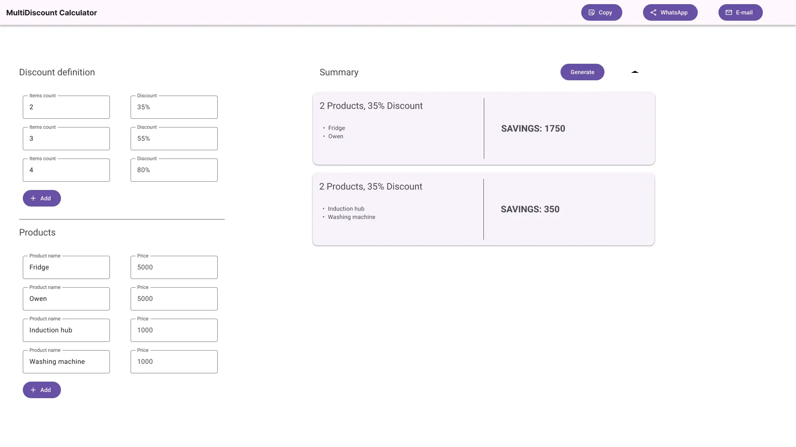
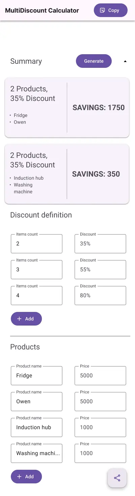

# Multidiscount calculator

> Part 3

## Description

In this part we are going to add button to share generated report via chat applications and e-mail

## Setting up

Please reuse code from **Part 2**.

## Requirements

1. Create an app header. Inside header user should see app title and copy to clipboard button. In case of Desktop device
   user should also see 2 additional buttons to share via email and WhatsApp
2. If user is using a mobile device then inside app bar only title and copy to clipboard button should be visible. Share option
   should be available under fab button in the right button corner of the app
3. If user is using mobile web-browser generated report should be shared via native `Web Share API`
4. If user is using a desktop web-browser there should be a possibility to share generated report via:
   - WhatsApp
   - E-mail
5. After user click copy to clipboard button summary should be copied to device clipboard and notification which says 
  "Copied to clipboard" should be presented to the user
6. If report is not generated sharing options should be disabled

## Design proposition

## Hints

- Share data via native API: [Web Share API](https://developer.mozilla.org/en-US/docs/Web/API/Web_Share_API)
- Web clipboard API: [Clipboard API](https://developer.mozilla.org/en-US/docs/Web/API/Clipboard_API)
- How to share via email using `mailto`: [Set mail subject and body](https://stackoverflow.com/a/4782084/9095988)
- What is Fab Button: [Material design Fab](https://m3.material.io/components/floating-action-button/guidelines)
